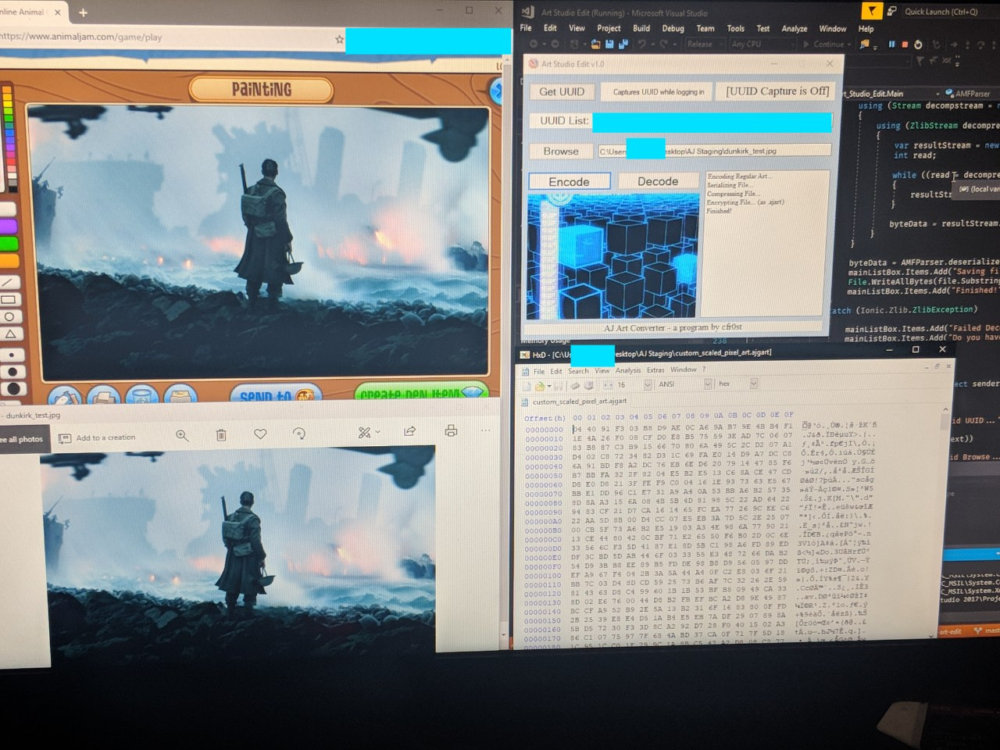

# .ajart / .ajgart file format specifications:
This serves as documentation of the .ajart / .ajgart file format from the online video game "Animal Jam", a proprietary format used by the game to store and load the artwork users create. The purpose of such a project is for multiple factors including criticism, comment, teaching, research, and interoperability. I used Visual Studio 2017 and created a WinForms projects using C# 4.6.2 as the demonstration of this knowledge.

### Technical File Format Overview:
For a technical overview of the .ajart / .ajgart file format:
[File Format.md](https://github.com/f1r3fr0st/aj-art-edit/blob/master/File%20Format.md)

### The Research Itself:
For an explanation on how exactly this was done:
[Research Process.md](https://github.com/f1r3fr0st/aj-art-edit/blob/master/Research%20Process.md)

### An Implemented Example:

A full code implementation is located in the [src](https://github.com/f1r3fr0st/aj-art-edit/tree/master/src/Art%20Studio%20Liberator) directory, and a barebones console implementation of decoding .ajart / .ajgart files is located in the [experimental-decode](https://github.com/f1r3fr0st/aj-art-edit/tree/master/experimental-decode/ajart-decoder) directory.

# Legal Stuff:
In the U.S., Section 103(f) of the Digital Millennium Copyright Act (DMCA) (17 USC § 1201 (f) - Reverse Engineering) states that it is legal to reverse engineer and circumvent protections to achieve interoperability between computer programs (such as information transfer between applications). https://www.eff.org/issues/coders/reverse-engineering-faq

1. Notwithstanding the provisions of subsection (a)(1)(A), a person who has lawfully obtained the right to use a copy of a computer program may circumvent a technological measure that effectively controls access to a particular portion of that program for the sole purpose of identifying and analyzing those elements of the program that are necessary to achieve **interoperability** of an independently created computer program with other programs, and that have not previously been readily available to the person engaging in the circumvention, to the extent any such acts of identification and analysis do not constitute infringement under this title.

2. Notwithstanding the provisions of subsections (a)(2) and (b), a person may develop and employ technological means to circumvent a technological measure, or to circumvent protection afforded by a technological measure, in order to enable the identification and analysis under paragraph (1), or for the purpose of enabling interoperability of an independently created computer program with other programs, if such means are necessary to achieve such interoperability, to the extent that doing so does not constitute infringement under this title.

3. The information acquired through the acts permitted under paragraph (1), and the means permitted under paragraph (2), may be made available to others if the person referred to in paragraph (1) or (2), as the case may be, provides such information or means solely for the purpose of enabling interoperability of an independently created computer program with other programs, and to the extent that doing so does not constitute infringement under this title or violate applicable law other than this section.

4. For purposes of this subsection, the term ‘interoperability’ means the ability of computer programs to exchange information, and of such programs mutually to use the information which has been exchanged.

The Copyright Act of 1976, 17 U.S.C. § 107 states specifically:

Notwithstanding the provisions of sections 106 and 106A, the fair use of a copyrighted work, including such use by reproduction in copies or phonorecords or by any other means specified by that section, for purposes such as **criticism**, **comment**, news reporting, **teaching (including multiple copies for classroom use)**, scholarship, or **research**, is not an infringement of copyright. In determining whether the use made of a work in any particular case is a fair use the factors to be considered shall include—

1. The purpose and character of the use, including whether such use is of a commercial nature or is for nonprofit educational purposes;
2. The nature of the copyrighted work;
3. The amount and substantiality of the portion used in relation to the copyrighted work as a whole; and
4. The effect of the use upon the potential market for or value of the copyrighted work.

**The fact that a work is unpublished shall not itself bar a finding of fair use if such finding is made upon consideration of all the above factors.**
